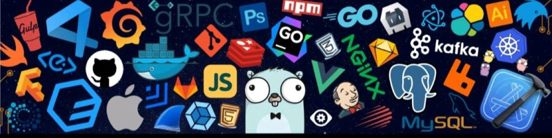
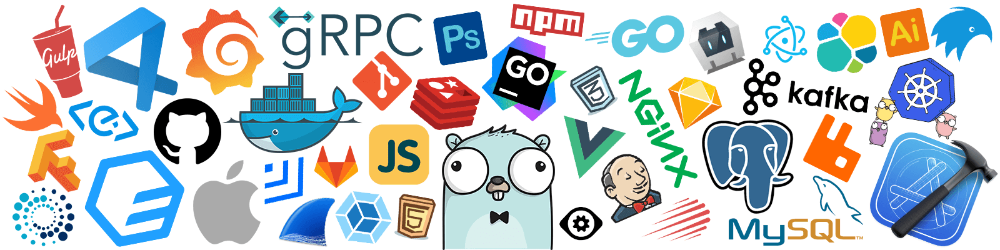

<!-- RAINBOW LINE BOT -->

## HI, I'm Felip's 🙋
          

## Social network:

## Languages and Tools:

 
    
    
    
    
    
    
      
      
     
    
      

      
## Most used programs:

    
    
    
    
    
    
    
    
    
    
    
    
    
     
     
         

    
   ## 🎨🎨 Designer
   

       
       
       
       
       
       
       
       
   

    <picture>
              <source media="(prefers-color-scheme: dark)" srcset="https://raw.githubusercontent.com/felipe123tadeu/felipe123tadeu/output/github-contribution-grid-snake-dark.svg">
              <source media="(prefers-color-scheme: light)" srcset="https://raw.githubusercontent.com/felipe123tadeu/felipe123tadeu/output/github-contribution-grid-snake.svg">
              
    </picture>
       
  <h4 align="center">
 My Github Stats 
</h4>

  
   
  

 

<!-- RAINBOW LINE BOT -->

