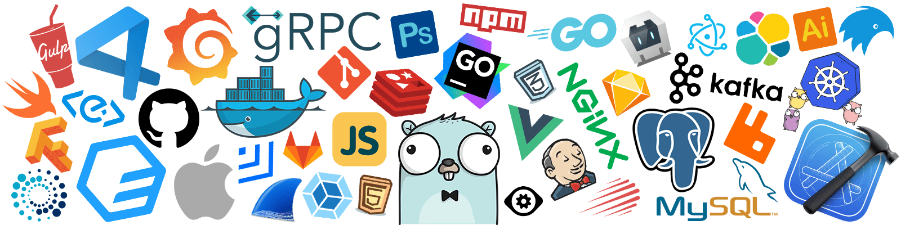

<imagem fonte="https://github.com/AnderMendoza/AnderMendoza/raw/main/assets/line-neon.gif" largura="100%">
<imagem largura=100% título="Desenvolvedor Hornet" alt="Desenvolvedor Hornet" fonte="https://capsule-render.vercel.app/api?type=waving&cor=gradiente&customColorList=6,11,20&alta=180&sessão=cabeçalho&texto=Desenvolvido Fullstack&tamanho da fonte=42&fontColor=fff&animação=brilhando&fontAlignY=40"/>

## OLÁ, sou do Phelype 🙋
          

## Rede social:

## Idiomas e ferramentas:
<dividir estilo="exibir: bloco_inline"> 
    <imagem alinhar="centro"alt="html5"fonte="https://img.shields.io/badge/HTML5-E34F26?style=for-the-badge&logotipo=html5&logoColor=branco" />
    <imagem alinhar="centro"alt="html5"fonte="https://img.shields.io/badge/CSS3-1572B6?style=for-the-badge&logotipo=css3&logoColor=branco" />
    <imagem alinhar="centro"alt="html5"fonte="https://img.shields.io/badge/C%2B%2B-00599C?style=for-the-badge&logotipo=c%2B%2B&logoColor=branco" />
    <imagem alinhar="centro"alt="html5"fonte="https://img.shields.io/badge/C%2B%2B-00599C?style=for-the-badge&logotipo=c%2B%2B&logoColor=branco" />
    <imagem alinhar="centro"alt="html5"fonte="https://img.shields.io/badge/PHP-777BB4?style=for-the-badge&logotipo=php&logoColor=branco" />
    <imagem alinhar="centro"alt="html5"fonte="https://img.shields.io/badge/Java-ED8B00?style=for-the-badge&logotipo=openjdk&logoColor=branco" />
    <imagem alinhar="centro"alt="html5"fonte="https://img.shields.io/badge/Python-14354C?style=for-the-badge&logotipo=python&logoColor=branco" />  
    <imagem alinhar="centro"alt="html5"fonte="https://img.shields.io/badge/Markdown-000000?style=for-the-badge&logotipo=markdown&logoColor=branco" />  
    <imagem alinhar="centro"alt="html5"fonte="https://img.shields.io/badge/Bootstrap-563D7C?style=for-the-badge&logotipo=bootstrap&logoColor=branco" /> 
    <imagem alinhar="centro"alt="html5"fonte="https://img.shields.io/badge/MySQL-00000F?style=for-the-badge&logotipo=mysql&logoColor=branco"/>
    <imagem alinhar="centro"alt="html5"fonte="https://img.shields.io/badge/Wordpress-21759B?style=for-the-badge&logotipo=wordpress&logoColor=branco">  
<dividir>

      
## Programas mais utilizados:
<dividir estilo="exibir: bloco_inline">
    <imagem alinhar="centro"alt="html5"fonte="https://img.shields.io/badge/Adobe%20Photoshop-31A8FF?style=for-the-badge&logotipo=Adobe%20Photoshop&logotipoCor=preto" />
    <imagem alinhar="centro"alt="html5"fonte="https://img.shields.io/badge/Adobe%20Lightroom-31A8FF?style=for-the-badge&logotipo=Adobe%20Lightroom&logotipoCor=preto" />
    <imagem alinhar="centro"alt="html5"fonte="https://img.shields.io/badge/Adobe%20after%20affects-CF96FD?style=for-the-badge&logotipo=Adobe%20após%20efeitos&logotipoCor=preto" />
    <imagem alinhar="centro"alt="html5"fonte="https://img.shields.io/badge/Canva-%2300C4CC.svg?&estilo=para o emblema&logotipo=Canva&logoColor=branco" />
    <imagem alinhar="centro"alt="html5"fonte="https://img.shields.io/badge/Figma-F24E1E?style=for-the-badge&logotipo=figma&logoColor=branco" />
    <imagem alinhar="centro"alt="html5"fonte="https://img.shields.io/badge/Colab-F9AB00?style=for-the-badge&logotipo=googlecolab&cor=525252" />
    <imagem alinhar="centro"alt="html5"fonte="https://img.shields.io/badge/Microsoft_Word-2B579A?style=for-the-badge&logotipo=palavra da Microsoft&logoColor=branco" />
    <imagem alinhar="centro"alt="html5"fonte="https://img.shields.io/badge/Microsoft_Excel-217346?style=for-the-badge&logotipo=microsoft-excel&logoColor=branco" />
    <imagem alinhar="centro"alt="html5"fonte="https://img.shields.io/badge/Microsoft_Office-D83B01?style=for-the-badge&logotipo=microsoft-office&logoColor=branco" />
    <imagem alinhar="centro"alt="html5"fonte="https://img.shields.io/badge/Microsoft_SQL_Server-CC2927?style=for-the-badge&logotipo=microsoft-sql-server&logoColor=branco" />
    <imagem alinhar="centro"alt="html5"fonte="https://img.shields.io/badge/Notion-000000?style=for-the-badge&logotipo=noção&logoColor=branco" />
    <imagem alinhar="centro"alt="html5"fonte="https://img.shields.io/badge/Trello-0052CC?style=for-the-badge&logotipo=trello&logoColor=branco" />
    <imagem alinhar="centro"alt="html5"fonte="https://img.shields.io/badge/Microsoft_PowerPoint-B7472A?style=for-the-badge&logotipo=microsoft-powerpoint&logoColor=branco" />
     <imagem alinhar="centro"alt="html5"fonte="https://img.shields.io/badge/Microsoft_Visio-3955A3?style=for-the-badge&logotipo=microsoft-visio&logoColor=branco" />
     <imagem alinhar="centro"alt="html5"fonte="https://img.shields.io/badge/Microsoft_Edge-0078D7?style=for-the-badge&logotipo=Microsoft-edge&logoColor=branco" />
     <imagem alinhar="centro"alt="html5"fonte="https://img.shields.io/badge/GIT-E44C30?style=for-the-badge&logotipo=git&logoColor=branco" />    
<dividir>
    
   ## 🎨🎨 Designer
   <dividir estilo="exibir: bloco_inline">
       
       
       
       
       
       
       
       
   

    <picture>
              <source media="(prefers-color-scheme: dark)" srcset="https://raw.githubusercontent.com/felipe123tadeu/felipe123tadeu/output/github-contribution-grid-snake-dark.svg">
              <source media="(prefers-color-scheme: light)" srcset="https://raw.githubusercontent.com/felipe123tadeu/felipe123tadeu/output/github-contribution-grid-snake.svg">
              
    </picture>
       
  <h4 align="center">
 My Github Stats 
</h4>

  
   
  

 

<!-- RAINBOW LINE BOT -->

